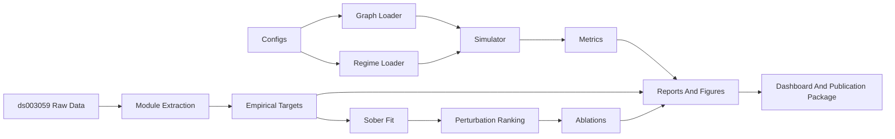
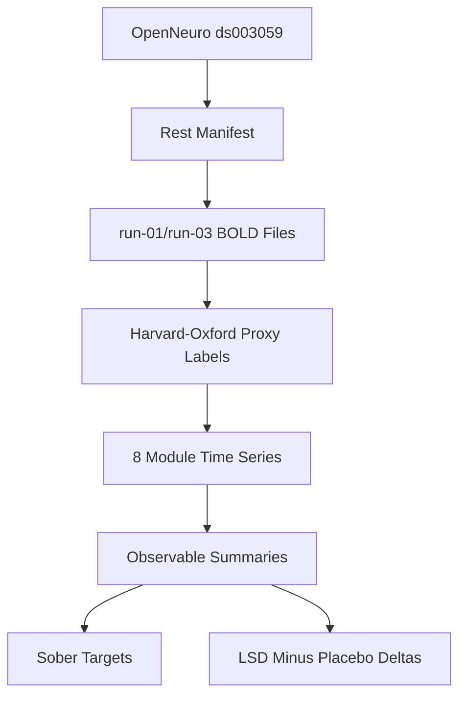
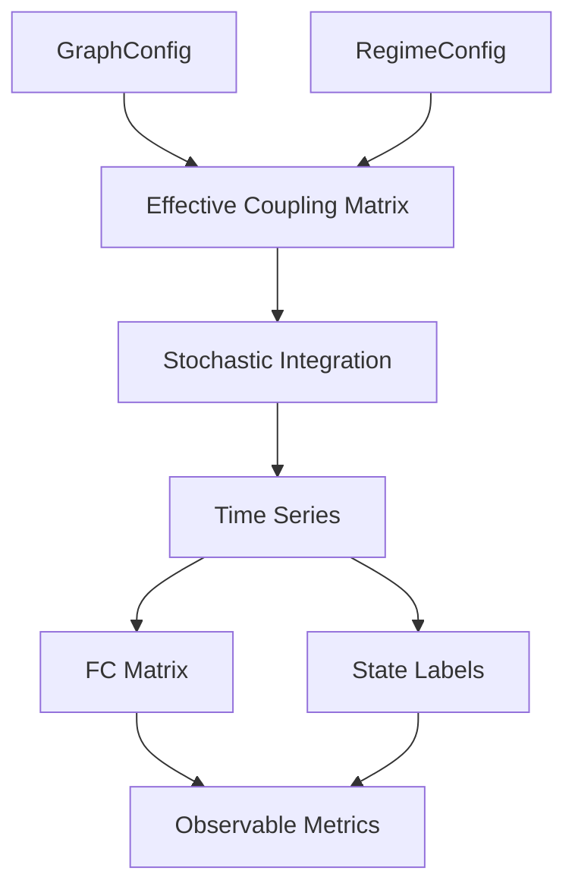
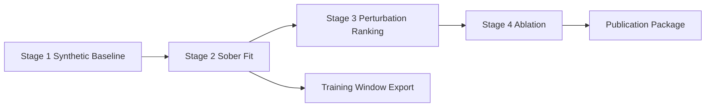
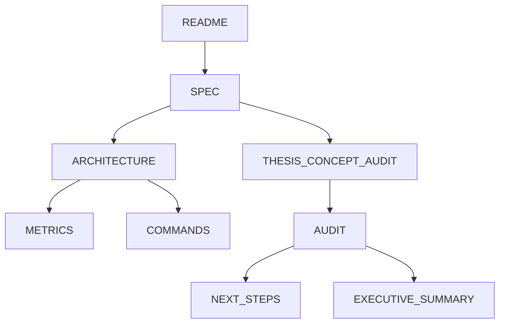

# Architecture

## Layer A - Explanation For Yuval

This project is a transparent macro-scale surrogate model. It uses eight coarse brain-inspired modules connected by a weighted graph. Each module has a latent activity state. The simulator runs a sober baseline and altered-state-inspired perturbations, then compares proxy metrics such as cross-module coupling, entropy-like diversity, switching rate, and metastability.

The most important files are:

- `SPEC.md`: conceptual model and equation.
- `configs/`: graph, sober regime, perturbed regime, and target definitions.
- `src/lsd_thesis/simulator.py`: the model loop.
- `src/lsd_thesis/metrics.py`: proxy observables.
- `src/lsd_thesis/data/ds003059.py`: empirical bridge.
- `scripts/run_pipeline.py`: staged workflow.
- `docs/stage_reports/`: generated stage summaries.

Outputs mean "model-level proxy behavior", not true subjective experience or receptor biology. The strongest current story is mismatch analysis: the repo shows which simple perturbations match or fail against coarse ds003059 deltas.

What is still unclear: whether the current 8-module anatomical proxy is the right empirical target, whether KMeans-derived dynamic metrics are robust enough, and whether the perturbation operators have enough sensitivity.

## Layer B - Technical Explanation

### System Architecture

### Data Flow

### Model Pipeline

### Experiment Pipeline

### Documentation Map

### State Variables And Parameters

- `x_i`: latent module state.
- `a_i`: adaptation state.
- `barrier`: local bistability/metastability control.
- `rigidity`: pull toward module baseline.
- `cross_group_scale`: cross-network coupling multiplier.
- `constraint_scale`: pull toward hierarchy projection.
- `temperature`: stochastic noise amplitude.
- `tau`: module timescale.

### Metrics

Metrics are proxies: FC matrix, within-network stability, cross-network communication, thalamic coupling, hierarchical compression, entropy/diversity, switching rate, metastability proxy, and effective barrier proxy.

### Config Structure

- `configs/graphs/macro_modules.yaml`: modules, adjacency, hierarchy projection.
- `configs/regimes/baseline.yaml`: sober baseline.
- `configs/regimes/perturbed.yaml`: example altered-state-inspired regime.
- `configs/targets/*.yaml`: sober and perturbation target summaries.

### Test Strategy

Use fixed-seed deterministic tests, metric shape/range tests, CLI dispatch tests, web payload tests, ds003059 helper tests, and publication artifact tests. Mark or isolate slow numerical tests when needed.

### Known Limitations

The model is coarse, proxy-based, and not biologically mechanistic. The current empirical extraction has known sign conflicts, and dynamic metrics require sensitivity analysis.
