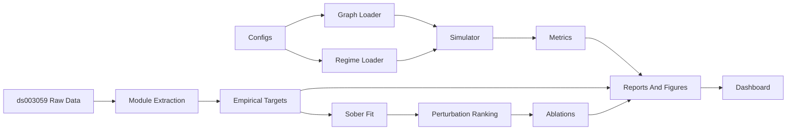
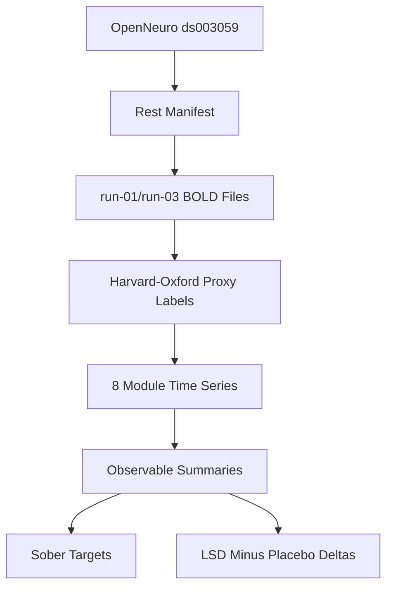
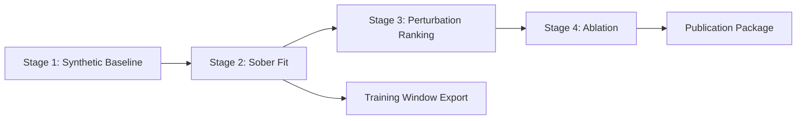

# Architecture

## Overview

This project is a transparent macro-scale surrogate model using eight
coarse brain-inspired modules connected by a weighted graph. Each module
has a latent activity state. The simulator runs a sober baseline and
altered-state-inspired perturbations, then compares proxy metrics.

Alongside the model, a prior-art landscape documents all known analyses
of the OpenNeuro ds003059 dataset across 12 research families.

> **Important:** Outputs mean "model-level proxy behavior", not true
> subjective experience or receptor biology.

---

## System Architecture

## Data Flow

## Experiment Pipeline

## Key Files

| File | Purpose |
|------|---------|
| `SPEC.md` | Model equations and stage definitions |
| `configs/` | Graph, regime, and target configurations |
| `src/lsd_thesis/simulator.py` | Stochastic integration loop |
| `src/lsd_thesis/metrics.py` | Proxy observables |
| `src/lsd_thesis/data/` | Empirical data ingestion |
| `src/lsd_thesis/web/` | Dashboard application |
| `scripts/run_pipeline.py` | Staged workflow |
| `prior_art/` | ds003059 literature landscape |

## State Variables

| Variable | Role |
|----------|------|
| `x_i` | Latent module state |
| `a_i` | Adaptation state |
| `barrier` | Local bistability / metastability control |
| `rigidity` | Pull toward module baseline |
| `cross_group_scale` | Cross-network coupling multiplier |
| `constraint_scale` | Pull toward hierarchy projection |
| `temperature` | Stochastic noise amplitude |
| `tau` | Module timescale |

## Metrics

All metrics are proxies: FC matrix, within-network stability,
cross-network communication, thalamic coupling, hierarchical compression,
entropy/diversity, switching rate, metastability proxy, effective barrier.

## Config Structure

| File | Content |
|------|---------|
| `configs/graphs/macro_modules.yaml` | Module definitions, adjacency, hierarchy |
| `configs/regimes/baseline.yaml` | Sober baseline parameters |
| `configs/regimes/perturbed.yaml` | Altered-state perturbation |
| `configs/targets/*.yaml` | Empirical target signatures |

## Test Strategy

Fixed-seed deterministic tests, metric shape/range tests, CLI dispatch,
web payload tests, ds003059 helper tests, publication artifact tests.
Slow numerical tests are marked with `@pytest.mark.slow`.

## Known Limitations

- Model is coarse, proxy-based, not biologically mechanistic
- Current 8-module extraction has known sign conflicts
- Dynamic metrics require sensitivity analysis
- KMeans-derived state labels may not be stable
