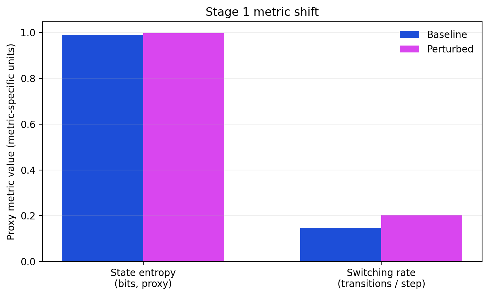
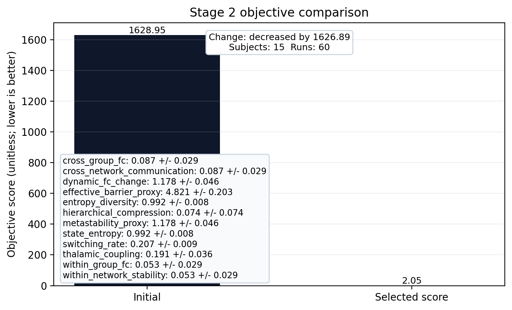

# Transparent Surrogate Modeling of Altered-State-Inspired Macro-Dynamics
Prepared for thesis defense and technical review.

## Executive Summary

This report analyzes the repository as a complete thesis artifact rather than as a conventional software project. The central output of the repository is not a claim that LSD has been mechanistically simulated. Instead, the repository implements a transparent surrogate model of altered-state-inspired macro-dynamics, grounded in coarse whole-brain modules, explicit graph structure, and summary statistics extracted from real resting-state fMRI data.

The project combines four major components. First, it defines an eight-module stochastic dynamical system with interpretable control terms for local stability, adaptation, graph coupling, top-down constraint, and stochasticity. Second, it connects that simulator to real data from OpenNeuro dataset `ds003059`, retaining only placebo and LSD resting-state runs and excluding music runs. Third, it derives a shared metric space in which simulated and empirical dynamics can be compared using the same observables. Fourth, it exposes all of this through saved reports, figures, machine-readable summaries, and a dashboard for model inspection and empirical review.

The most defensible result of the repository is methodological. The codebase demonstrates an inspectable end-to-end pipeline that moves from public neuroimaging data to macro-module extraction, to sober-regime fitting, to perturbation ranking, ablation, and benchmark export. The pipeline is reproducible through machine-readable artifacts and explicit verification commands rather than hard-coded pass/fail prose in this report. However, the strongest scientific conclusion is negative or at least strongly qualified: the current eight-module extraction and the current perturbation family do not yet reproduce a robust, canonical psychedelic macro-signature.

The repository therefore succeeds as a transparent hypothesis-ranking and falsification environment. It does not yet succeed as a strong explanatory model of psychedelic whole-brain dynamics. For thesis defense purposes, that distinction is not a weakness to hide. It is one of the central intellectual contributions of the work.

## Abstract

This repository implements a transparent surrogate model for altered-state-inspired whole-brain macro-dynamics. The system is explicitly positioned as a graph-modulated macro-scale analogue rather than as a receptor model, a simulator of subjective experience, or a clinical decision system. Its scientific aim is modest but non-trivial: to determine whether a simple, interpretable dynamical system can be fitted to empirical placebo resting-state summaries and then perturbed in ways that partially reproduce LSD-associated changes observed in a real dataset.

The model comprises eight coarse brain modules linked by a weighted graph and governed by stochastic bistable dynamics with adaptation and an optional low-dimensional hierarchical constraint. The empirical branch of the repository downloads and processes real resting-state functional MRI data from `OpenNeuro ds003059 placebo resting-state summary (15 session averages)`, retaining only `run-01` and `run-03` for both `ses-PLCB` and `ses-LSD`. A transparent Harvard-Oxford-based anatomical proxy is then used to compress these data into eight module time series. Shared observables are computed for both simulated and empirical data, including within-network stability, cross-network communication, thalamic coupling, hierarchical compression, entropy/diversity, switching rate, a metastability proxy, and an effective barrier proxy.

The repository demonstrates several concrete achievements. It produces actual empirical target files from `ds003059`, calibrates a sober regime against placebo-derived targets, ranks abstract perturbation families against empirical LSD-minus-placebo deltas, runs ablation analyses, exports a training-ready windowed dataset, and exposes results through a browser dashboard. The engineering stack is well developed and records saved summaries plus visual artifacts for every stage; the current verification status should be taken from the latest command log and machine-readable validation artifacts, not from static thesis prose.

At the same time, the scientific limitations are explicit. The current eight-module mapping is intentionally coarse and not canonical. Several empirical deltas extracted under this mapping differ in sign from literature-based expectations. The best-scoring perturbation family remains a weak proxy-objective hypothesis rather than a convincing mechanistic explanation. In short, the repository provides a transparent modeling framework and a partially successful empirical bridge, but not yet a robust explanatory account of psychedelic neurodynamics.

## 1. Introduction and Problem Statement

Computational work on psychedelics often faces an immediate tradeoff between interpretability and expressivity. Highly detailed mechanistic models are difficult to justify with available data and often collapse under parameter uncertainty. Highly flexible machine learning models can discover predictive structure, but they usually make it difficult to explain why a result occurred or which mechanistic story a result should support. The repository analyzed here chooses a different path. It asks whether a transparent, low-dimensional, graph-based surrogate can reproduce selected macro-dynamic signatures associated with psychedelic states while remaining narrow in its claims and explicit in its limitations.

That framing matters. The project is not attempting to simulate receptor pharmacology. It is not attempting to simulate subjectively reported experience. It is not attempting to decode consciousness or to infer clinical response. Instead, the project seeks a defensible middle ground: a model that is simple enough to understand, cheap enough to ablate, structured enough to be empirically challenged, and grounded enough in real neuroimaging data to be more than a purely conceptual toy.

The repository addresses a practical scientific problem. If one starts from a whole-brain viewpoint and intentionally compresses the system into a small number of large modules, which families of perturbation remain plausible as explanations for altered-state-like dynamics? Put differently, if one only allows visible graph structure, a small set of state variables, and a small set of control terms, what signatures can be matched, which cannot be matched, and where does the model fail? This project treats failure as a result rather than as a reason to obscure the analysis.

The software structure reflects that scientific stance. The code prioritizes explicit configuration, limited mathematical complexity, saved outputs, and repeated opportunities for inspection. The result is a repository that should be read both as a scientific artifact and as a thesis defense object. The question is not merely whether the code runs. The question is whether the repository supports claims that can survive critical academic scrutiny.

## 2. Research Objectives and Thesis Questions

The repository is organized around four linked research questions.

- Can a small graph-coupled surrogate model generate macro-scale signatures associated with altered-state-like brain dynamics while preserving interpretability?
- Can real placebo resting-state summaries extracted from `ds003059` be used to calibrate a sober reference regime for that surrogate model?
- Once such a sober regime has been calibrated, which abstract perturbation mechanisms most closely match empirical LSD-minus-placebo changes under the repository's chosen observable space?
- Can the same empirical windows that support surrogate-model evaluation also support auxiliary predictive benchmarks, thereby establishing that the extracted signal contains usable condition information?

From these questions, the repository makes several intended contributions.

- It proposes a transparent eight-module dynamical model that is simple enough to explain term by term.
- It implements a real empirical bridge from OpenNeuro data to model-facing macro targets.
- It uses a shared observable space so that empirical and simulated outputs are compared on common footing.
- It treats perturbation ranking as a formal hypothesis-ordering problem rather than as a narrative exercise.
- It preserves interpretability through saved figures, reports, cached viewer payloads, and explicit configuration.

The repository therefore attempts to contribute both methodologically and scientifically. Methodologically, it shows how to structure a cautious surrogate-model workflow. Scientifically, it provides evidence about which macro-scale perturbations are and are not plausible within the chosen model class.

## 3. Scientific Scope and Claim Boundaries

One of the strongest aspects of the repository is that it repeatedly narrows its claims. The local `AGENTS.md`, the main `README.md`, the limitations document, and the stage reports all insist on the same framing. The model is a surrogate. Its perturbations are altered-state-inspired. Its observables are macro-dynamic proxies. This restraint is not cosmetic. It is central to the validity of the project.

Several claims are therefore outside the legitimate scope of the repository.

- The repository does not model serotonin receptor binding or intracellular signaling.
- It does not model the pharmacokinetics or pharmacodynamics of LSD.
- It does not claim to simulate conscious content, ego dissolution, or the phenomenology of a psychedelic experience.
- It does not provide subject-level diagnosis, prognosis, or treatment guidance.
- It does not establish biological ground truth for metastability, switching barriers, or hierarchy.

Conversely, several narrower claims are within scope.

- The repository does implement a mathematically explicit stochastic whole-brain surrogate with graph-modulated interactions.
- It does derive real macro-module summaries from a public LSD dataset.
- It does fit a sober regime against placebo-derived metrics and compare perturbed simulations to empirical deltas.
- It does show where those comparisons succeed, where they fail, and where the interpretation becomes unstable.

This disciplined scope is exactly what protects the thesis. A transparent model that fails honestly is more defensible than an ambitious model that overclaims.

## 4. Repository Architecture and Staged Workflow

The repository is organized as a staged scientific pipeline. The top-level script `scripts/run_pipeline.py` orchestrates the major phases. Its command structure reflects the research workflow rather than a generic software release process.

- Stage 1 generates synthetic baseline and perturbed simulations and saves graphs, activity traces, FC matrices, diversity summaries, and switching summaries.
- Stage 2 either loads preconfigured sober targets or, when the dataset directory is present, generates empirical targets directly from `ds003059`, fits a sober regime, saves figures, and emits machine-readable provenance.
- Stage 3 fits a sober reference regime again, applies a grid of perturbation mechanisms, and ranks them against empirical LSD-minus-placebo target deltas.
- Stage 4 performs single-mechanism and pairwise ablation analysis using the best available strengths from Stage 3.
- Follow-up commands export a training dataset and run local benchmark scripts for condition prediction and multitask spectral regression.

At the package level, the architecture is equally explicit.

- `src/lsd_thesis/core.py` defines fixed implementation module names and typed configuration models.
- `src/lsd_thesis/graph.py` loads graph topology and hierarchy projection matrices.
- `src/lsd_thesis/simulator.py` runs the surrogate dynamics.
- `src/lsd_thesis/metrics.py` defines the common observable space.
- `src/lsd_thesis/data/ds003059.py` manages empirical extraction and target generation.
- `src/lsd_thesis/fit.py` calibrates a sober regime.
- `src/lsd_thesis/perturbation.py` ranks abstract perturbation mechanisms.
- `src/lsd_thesis/ablation.py` performs single and pairwise ablations.
- `src/lsd_thesis/data/empirical_viewer.py` builds dashboard-facing empirical payloads.
- `src/lsd_thesis/web/app.py` serves the dashboard and artifact endpoints.
- `src/lsd_thesis/training.py` slices empirical trajectories into windowed datasets for downstream benchmarks.

This architecture matters academically because each stage exposes an audit boundary. One can inspect graph definitions independently of simulator code, simulator code independently of empirical extraction, and empirical extraction independently of perturbation scoring. The repository is therefore legible in a way that many scientific codebases are not.

## 5. Mathematical Model and Dynamical Assumptions

The central simulator is defined in the project specification as a graph-coupled stochastic dynamical system with adaptation and an optional low-dimensional top-down constraint. In plain form, each module state evolves under the combined effect of a bistable local potential, a restoring rigidity term, an adaptation term, cross-module graph input, a hierarchy-projection constraint, and stochastic noise.

The intended interpretation of each term is as follows.

- The barrier term determines how deep or shallow a module's local metastable landscape is within the model.
- The rigidity term determines how strongly a module is pulled back toward its baseline.
- The adaptation term discourages indefinite occupation of the same state.
- The graph coupling term allows neighboring modules to influence one another through a weighted adjacency matrix.
- The hierarchy constraint term pulls the evolving state back toward a sober low-dimensional manifold encoded by the matrix `H`.
- The temperature term injects stochastic variability.
- The timescale term determines how quickly each module responds.

The repository defines eight modules in a fixed implementation order:

- visual
- auditory
- salience
- default_mode
- executive_frontoparietal
- limbic_affective
- thalamic_gateway
- sensorimotor

These modules are themselves grouped into broader categories. Visual, auditory, and sensorimotor belong to a sensory group. Salience, default mode, executive frontoparietal, and limbic affective belong to an associative group. Thalamic gateway is treated as its own gateway group. This grouping matters because the simulator scales within-group and cross-group coupling separately, and several observables are defined in terms of this distinction.

The baseline and altered-state-inspired regimes are specified in YAML, which is another strength of the project. The model is not hidden behind arbitrary code constants. The baseline regime has stronger rigidity, deeper barriers, lower cross-group scale, and stronger hierarchy constraint. The altered-state-inspired regime lowers rigidity and barriers, increases cross-group scale and temperature, and weakens the hierarchy constraint. These are exactly the kinds of manipulations one would want to inspect and debate in a thesis setting.

At the same time, the mathematical simplicity imposes limits. The model has no explicit hemodynamics, no receptor layer, no structural connectome, no subject-specific parameterization, and no formal identifiability analysis. Those omissions do not invalidate the model. They define its epistemic ceiling.

## 6. Empirical Data Source and Dataset Provenance

The empirical branch of the repository is anchored to OpenNeuro dataset `ds003059`, version `1.0.0`. The local dataset metadata present in `data/ds003059/dataset_description.json` identifies the dataset as a derivative release titled *Neural correlates of the LSD experience revealed by multimodal neuroimaging*, with BIDS version `1.4.0`, license `CC0`, and dataset DOI `10.18112/openneuro.ds003059.v1.0.0`. The local `README` inside the dataset explicitly states that Rest1 and Rest3 are resting-state scans and that Rest2 is a music condition. The repository therefore excludes `run-02` and uses only `run-01` and `run-03`.

This choice is scientifically sensible and explicitly documented in code. The Stage 2 extraction path retains only the following:

- sessions `ses-LSD` and `ses-PLCB`
- task-rest runs only
- `run-01` and `run-03`

The Stage 2 summary saved in `results/stage_2/stage_2_summary.json` records a small internal empirical cohort comprising fifteen paired subjects and sixty total resting runs. The subjects used are `sub-001`, `sub-002`, `sub-003`, `sub-004`, `sub-006`, `sub-009`, `sub-010`, `sub-011`, `sub-012`, `sub-013`, `sub-015`, `sub-017`, `sub-018`, `sub-019`, and `sub-020`. The dataset README reports fifteen subjects after its own motion-related exclusions; this repository inherits that derivative preprocessing and does not independently re-estimate motion, FD/DVARS, confounds, or censoring.

An important methodological point is that the repository does not preprocess raw scanner data from scratch. It downloads BOLD files from the derivative dataset and inherits the preprocessing history described by the dataset authors. That preprocessing history is substantial and includes despiking, slice-time correction, motion correction, brain extraction, spatial normalization, scrubbing, smoothing, band-pass filtering, detrending, and nuisance regression. This is not a weakness in itself. It simply means that the thesis must acknowledge that the project sits on top of a preprocessed derivative rather than on minimally processed raw acquisitions.

This provenance strengthens the report in two ways. First, it grounds the model in a specific, citable empirical object rather than in generic psychedelic literature. Second, it defines the boundaries of what the repository can legitimately claim about empirical validity.

## 7. Macro-Module Extraction Strategy

The key compression step in the repository is the conversion of volumetric BOLD data into eight coarse module time series. This is implemented in `src/lsd_thesis/data/ds003059.py`. The repository uses a transparent proxy mapping built from the Harvard-Oxford cortical and subcortical atlases as fetched through Nilearn. Each of the eight target modules is associated with a small set of cortical and, when relevant, subcortical atlas labels. These labels are merged into a custom integer-valued label image, and average time series are then extracted for each module.

The transparency of this step is a major virtue. The mapping is inspectable, deterministic, and reproducible. There is no hidden neural network embedding, no latent parcel estimation, and no opaque dimensionality reduction. If one disagrees with the label assignments, one can inspect and replace them directly.

However, the scientific price of that transparency is equally clear. The module definitions are not canonical functional networks. They are a coarse anatomical proxy. The repository itself acknowledges this repeatedly. For that reason, the extracted deltas should not be read as if they were definitive statements about canonical default mode network disintegration, sensory expansion, or global integration under LSD. They are measurements in a custom macro space chosen for interpretability.

Technically, the extraction path is robust. The code first attempts extraction through `NiftiLabelsMasker` using sample z-scoring. If that path fails because of file access or format issues, it falls back to manual voxel averaging and explicit standardization. This fallback raises operational reliability. The extracted time series for each run are saved to disk under `results/stage_2/module_time_series/`, which is another important reproducibility feature because it prevents repeated expensive extraction and makes downstream review easier.

## 8. Shared Observable Space and Metric Definitions

The repository compares empirical and simulated dynamics in a common metric space. This design choice is one of the most important conceptual commitments in the codebase. Rather than comparing raw time series directly, it compares higher-level observables that are computed in the same way from both empirical module traces and simulated module traces.

The observables are:

- within-network stability: mean FC among modules belonging to the same coarse group
- cross-network communication: mean FC among modules belonging to different coarse groups
- thalamic coupling: mean FC between the thalamic gateway module and all other modules
- hierarchical compression: correlation between mean sensory and associative signals
- entropy/diversity: normalized entropy of state labels inferred from KMeans clustering
- switching rate: frequency of transitions between successive clustered states
- metastability proxy: average change in sliding-window FC vectors
- effective barrier proxy: mean dwell time in inferred state segments

Several implementation details deserve emphasis. State labels are generated by KMeans clustering over the time points of each trajectory. Functional connectivity is computed by correlation across module channels. Dynamic FC change uses sliding windows and upper-triangle vector differences. Dwell time is based on change-point segmentation of the state label sequence. These are all reasonable macro-dynamic summaries, but they are still engineered proxies. They are not direct measurements of latent neural mechanisms.

This metric space does important work for the thesis. It defines what it would mean for the model to match the data. It also reveals where the model can fail. A mismatch is not hidden behind a subjective narrative. It is exposed as a disagreement in explicitly named summary variables.

## 9. Stage 1: Synthetic Baseline and Hand-Designed Perturbation

Stage 1 is the conceptual proof-of-behavior phase. The code runs both the sober baseline regime and the altered-state-inspired YAML regime and compares their outputs on the shared metric space. This stage does not use empirical fitting. It asks whether the hand-designed perturbation at least moves the model in broadly intended directions.

### Stage 1 synthetic shift snapshot

*Figure: Stage 1 compares baseline and perturbed proxy values for entropy and switching rate with units shown on the axis labels.*

*Limitation: These are surrogate macro-dynamics only. They do not claim receptor-level realism, subjective experience, or direct biological measurement.*

The current Stage 1 evidence is directionally mixed. Baseline state entropy is `0.989` and perturbed state entropy is `0.998`. The corresponding switching rates move from `0.147` to `0.203`. These shifts support the interpretation that the perturbation expands the model's effective state repertoire and increases turnover, but they do not by themselves validate the overall altered-state-inspired regime.

The saved Stage 1 summary shows a mixed result.

- baseline entropy: `0.9890`
- perturbed entropy: `0.9976`
- baseline switching rate: `0.1471`
- perturbed switching rate: `0.2032`
- baseline cross-group FC: `0.0864`
- perturbed cross-group FC: `-0.0149`
- baseline dynamic FC change: `1.2654`
- perturbed dynamic FC change: `1.2570`

Two findings support the altered-state-inspired intuition. Entropy increases, suggesting a broader surrogate state repertoire, and switching rate increases, suggesting less local persistence. In addition, within-group FC decreases, which is consistent with reduced local stability under perturbation.

However, two findings immediately undermine any claim of straightforward success. Cross-group FC decreases rather than increasing, despite the configured increase in cross-group coupling, and dynamic FC change does not increase. The Stage 1 report interprets this correctly: the first perturbation appears to produce decorrelation or noise rather than a clean increase in integrative dynamics.

Scientifically, Stage 1 should therefore be framed as a preliminary sanity check, not as evidence that the hand-designed altered-state-inspired regime is already valid. This is important for defense. The repository does not hide the failure. It carries the problem forward into later stages, which is exactly the right scientific move.

## 10. Stage 2: Empirical Bridge and Sober-Regime Fitting

The current empirical bridge uses fifteen paired subjects and sixty total resting runs. The Stage 2 fit statement is: Stage 2 objective changed from 1628.945 to 2.054 (decreased); lower scores are better. The selected score comes from the optimization step.

Stage 2 is the empirical core of the repository. It contains two conceptually distinct subproblems. The first is empirical target generation. The second is calibration of a sober reference regime against placebo-derived targets.

### 10.1 Empirical Target Generation

The empirical generation path is explicit and well structured.

- The code queries the OpenNeuro GraphQL API to reconstruct the dataset file tree.
- It filters that file tree to the exact sessions and runs required for the study design.
- It downloads only the BOLD files required for the selected rest runs.
- It extracts module time series for each run.
- It computes observable summaries for each run and saves those summaries to `empirical_run_summaries.json`.
- It aggregates placebo runs within subject, then across subjects, to build a sober target set.
- It computes paired LSD-minus-placebo deltas to build a perturbation target set.

The resulting files are central thesis artifacts.

- `results/stage_2/empirical_sober_targets.yaml`
- `results/stage_2/empirical_perturbation_targets.yaml`
- `results/stage_2/ds003059_rest_manifest.json`
- `results/stage_2/empirical_run_summaries.json`

The empirical sober target file shows group-level placebo metrics such as within-network stability `0.2823`, cross-network communication `0.1997`, thalamic coupling `0.2043`, entropy/diversity `0.9738`, metastability proxy `1.2027`, and effective barrier proxy `3.5334`. Confidence labels are attached using paired t-tests across placebo and LSD subject means. This is an aggregate consistency summary across paired runs, not a substitute for subject-level motion, FD/DVARS, confound, or censoring QC.

### 10.2 Sober-Regime Calibration

### Stage 2 fit and robustness snapshot

*Figure: Stage 2 compares the initial objective with the selected score from the optimization step and summarizes limited repeatability evidence.*

*Limitation: This figure summarizes a cached benchmark anchored to OpenNeuro ds003059 placebo resting-state summary (15 session averages). It is evidence of fit quality and run-to-run consistency, not a proof of generalization.*

The sober fit uses a transparent random search rather than a heavy optimizer. This choice is important both scientifically and rhetorically. The fit should be described as calibration, not as proof of global optimization. The code perturbs a baseline regime across a limited set of global parameters and module overrides, especially for the thalamic gateway, default mode, and executive frontoparietal modules.

The saved Stage 2 summary reports a small internal empirical cohort comprising fifteen paired subjects and sixty total resting runs. This bridge is the key reason the repository can make narrower empirical claims than narrative similarity alone, while still ruling out external or clinical validation claims.

By the repository's own loss function, this is a substantial reduction relative to the uncalibrated baseline. The best single-seed fitted metrics also move toward the placebo targets. For example, within-network stability reaches `0.2913`, cross-network communication reaches `0.1014`, entropy/diversity `0.8194`, and switching rate `0.2412`.

However, a deeper reading of the same summary exposes an important weakness. The repository also records multi-seed mean and standard deviation for the best regime. Across five seeds, the same regime produces mean within-network stability `0.0962 +/- 0.0239`, mean cross-network communication `0.0420 +/- 0.0256`, mean entropy/diversity `0.9912 +/- 0.0072`, and mean switching rate `0.2623 +/- 0.0156`. In other words, the best single-seed fit is not stable across repeated stochastic realizations.

This is one of the most important scientific findings in the repository. The calibration objective can discover a good-looking run, but the implied parameterization is not yet robust enough to support strong claims of identified sober dynamics. For defense purposes, this should be stated plainly. Stage 2 establishes that empirical anchoring is feasible and that the sober regime can be better aligned with placebo targets, but it does not yet establish a stable calibrated model in the stronger inferential sense.

Subject-disjoint held-out validation has not yet been configured or performed for Stage 2/3; the current evidence remains calibration plus stochastic diagnostics.

## 11. Stage 3: Perturbation Ranking Against Empirical LSD-minus-Placebo Deltas

In the current evidence, the best-scoring perturbation family is `less_hierarchical_constraint` at strength `0.25`. That result is directionally interesting in proxy-objective space, but it remains a weak macro-level hypothesis rather than a convincing mechanistic explanation.

Stage 3 is where the repository turns from calibration to explanatory testing. Given a fitted sober regime, the code applies four one-at-a-time perturbation families across a small strength grid:

- more cross-talk
- less hierarchical constraint
- more stochasticity
- lower switching barrier

The target is not a literature-averaged generic psychedelic signature. The target is the empirical LSD-minus-placebo delta extracted from the same Stage 2 pipeline. Under the current eight-module extraction, those empirical deltas are:

- within-network stability: `+0.0661`
- cross-network communication: `+0.0741`
- thalamic coupling: `+0.1199`
- hierarchical compression: `+0.0541`
- entropy/diversity: `-0.0023`
- switching rate: `+0.0123`
- metastability proxy: `-0.0540`
- effective barrier proxy: `-0.1492`

These values already reveal a critical interpretive challenge. When compared with the repository's literature-style target configuration in `configs/targets/empirical_lsd_signatures.yaml`, three signs disagree with canonical expectations:

- within-network stability is positive rather than negative
- entropy/diversity is slightly negative rather than positive
- metastability proxy is negative rather than positive

This means the mechanism-ranking problem is already constrained by a coarse empirical space that is only partly aligned with the broader literature. The repository acknowledges this in `docs/limitations.md`, and that acknowledgment is essential.

The best one-shot Stage 3 perturbation family is `less_hierarchical_constraint` at strength `0.25`. The seed-panel robust best-scoring perturbation family is `more_cross_talk` at strength `0.10`. These rankings are directionally interesting, but they remain weak macro-level hypotheses rather than convincing mechanistic explanations.

The current comparison also shows that sign mismatches remain for: `within_network_stability`, `entropy_diversity`, and `metastability_proxy`.

When the best model delta is compared with the empirical delta, the weaknesses become obvious.

- cross-network communication is overshot (`0.3543` model versus `0.0741` empirical)
- thalamic coupling is overshot (`0.4203` model versus `0.1199` empirical)
- hierarchical compression is overshot (`0.4498` model versus `0.0541` empirical)
- switching rate has the wrong sign (`-0.1171` model versus `+0.0123` empirical)
- metastability proxy has the wrong sign (`+0.0668` model versus `-0.0540` empirical)
- effective barrier proxy is catastrophically mismatched (`+3.8678` model versus `-0.1492` empirical)

The correct thesis interpretation is therefore that Stage 3 produces a ranked hypothesis list inside a limited model family. It does not identify a convincing mechanism of LSD-related whole-brain change. The repository's own report says as much, and that is scientifically appropriate.

## 12. Stage 4: Ablation and Pairwise Combination Analysis

The best current pairwise combination is `less_hierarchical_constraint+lower_switching_barrier`. The best single mechanism is `lower_switching_barrier` (score 5028.2029). The best pair is `less_hierarchical_constraint+lower_switching_barrier` (score 4819.2698), which outperformed the best single mechanism under the current objective; lower scores are better. This comparison is informative because it shows whether simple perturbation superposition helps under the current objective without turning that objective into a mechanistic claim.

Stage 4 extends Stage 3 by testing single mechanisms at their best available strengths and then testing pairwise combinations. This is the right next step in principle. If one mechanism is insufficient, perhaps a combination of reduced top-down constraint, increased noise, altered coupling, and weaker barriers could close the gap.

The saved Stage 4 summary reports:

- best single mechanism: `lower_switching_barrier`
- best single score: `5028.2029`
- best pairwise mechanism: `less_hierarchical_constraint+lower_switching_barrier`
- best pairwise score: `4819.2698`

The report generator derives this comparison from `Stage4Evidence` rather than fixed prose. The machine-readable Stage 4 summary should remain the authoritative numerical source whenever narrative artifacts are regenerated.

Substantively, Stage 4 still has value. Even a negative ablation result constrains the plausible explanation space. It suggests that the current simulator and current coarse metric extraction do not admit an easy rescue through simple perturbation superposition. That is useful information.

## 13. Dashboard, Artifact Layer, and Communicability

The repository does more than compute numbers. It exposes the pipeline through a dashboard and a dense artifact layer. This is not trivial polish. It is part of the scientific contribution because it makes the model inspectable by people who are not comfortable reading Python source.

The dashboard contains two viewers.

- A model explorer for synthetic simulations, adjustable parameters, and FC or ablation outputs.
- An empirical explorer for group-level placebo versus LSD summaries, paired subject/run inspection, windowed FC changes, module traces, and downsampled window-averaged preview slices.

The empirical viewer is especially valuable for a thesis defense because it closes the gap between raw downloaded volumes and model-facing metrics. The viewer exposes:

- subject selection
- run selection
- aligned placebo versus LSD views
- per-window previews of downsampled, plane-normalized fMRI-derived slices
- per-window module traces
- per-window FC matrices
- group-level uncertainty bands and error bars
- direct links to saved Stage 2 empirical figures and stage reports

This makes the repository useful as a communication artifact. A reviewer can inspect group means, then a paired subject, then a specific run, then a specific window, and then compare that with the metric summary files. The viewer should still be read as an exploratory proxy-data interface, not as a QC-complete neuroimaging browser.

The limitations are explicitly stated in code and docs. The raw views are downsampled previews, not a clinical imaging viewer. The metric blocks are descriptive rather than inferential. The atlas mapping remains a proxy. Those caveats should be retained in any thesis presentation.

## 14. Training Dataset Export and Auxiliary Benchmarking

The repository includes a secondary line of work that exports Stage 2 empirical windows into a training-ready dataset and benchmarks a few simple machine learning models. This branch does not replace the surrogate-model thesis. Instead, it asks whether the extracted windows contain enough structure to support auxiliary prediction tasks.

The exported dataset `results/training/ds003059_windows.npz` records window arrays, condition labels for placebo versus LSD, subject/session/run identifiers, and enough shape information for downstream scripts to report current sample counts. This template avoids fixed window counts because they can change when window length, stride, subject subset, or extraction settings change.

Evaluation uses leave-one-subject-out cross-validation through `LeaveOneGroupOut(subject)`, which is the right choice for avoiding subject leakage in a dataset this small.

The condition-only benchmark compares logistic regression, histogram gradient boosting, and a small temporal CNN. The strongest current condition model is `temporal_cnn`. This is not a strong classification result in absolute terms, but it is enough to support a modest claim that the extracted macro windows contain usable condition signal.

The multitask benchmark asks models to perform both condition classification and regression of the FC eigenspectrum of each window. The strongest current multitask model is `multitask_temporal_cnn`. This split result is intellectually interesting because it suggests that learned temporal features are helpful for condition discrimination, while explicit engineered FC geometry remains the stronger route to graph-level spectral targets. That aligns well with the broader surrogate philosophy of the repository. Transparent graph-informed features are still scientifically valuable and should not be assumed obsolete simply because a neural network is available.

The cloud training scaffold under `cloud/hf_jobs/train_sequence_autoencoder.py` remains minimal. It is best understood as infrastructure for future experiments rather than as a mature scientific result.

## 15. What Worked Well

Several aspects of the repository are genuinely strong and should be defended confidently.

First, the repository has a coherent scientific architecture. It is not a collection of disconnected notebooks. It has a staged pipeline, typed models, saved summaries, an empirical data bridge, and a dashboard. This already places it above many exploratory research codebases.

Second, the empirical path is real. The repository does not stop at literature-inspired targets. It queries OpenNeuro, downloads exact files, extracts module time series, constructs paired deltas, and records provenance. This is a meaningful accomplishment.

Third, the codebase is operationally healthy, but this generated report intentionally avoids embedding a fixed test count or dated validation claim. Use the latest machine-readable validation record, CI result, or local verification transcript for the current number of tests, coverage, lint status, and type-check status.

The system includes tests for simulator behavior, fit logic, perturbation logic, viewer caches, web integration, publication generation, and training helpers.

Fourth, the project saves its outputs systematically. Every stage writes reports, figures, JSON summaries, and, in Stage 2, empirical target files and viewer caches. This makes the project much easier to review and defend.

Fifth, the dashboard substantially strengthens interpretability. It is not merely decorative. It materially helps explain what the model is doing and how empirical targets are formed.

Finally, the benchmark branch supports a useful auxiliary internal claim: the extracted macro windows contain limited condition-relevant signal under the current proxy extraction. It is not evidence of biological mechanism or external predictive validity.

## 16. What Did Not Work or Remains Scientifically Weak

The repository is strongest when it admits its current failures. Several weaknesses should be framed openly rather than defensively.

The first weakness is the hand-designed altered-state-inspired perturbation in Stage 1. It does not produce a clean increase in cross-network integration, and it fails to increase dynamic FC change. This means the initial intuition was only partially successful.

The second weakness is the empirical extraction itself. Under the current eight-module Harvard-Oxford proxy, several LSD-minus-placebo deltas do not align with literature-level expectations. This may reflect the coarseness of the mapping, the fact that the repository works in a custom observable space, the derivative nature of the dataset, or some combination of the three.

The third weakness is calibration stability. Stage 2 records seed-disjoint selection and validation diagnostics, and the approved CV5 run adds subject-disjoint internal held-out evaluation under the same dataset and proxy extraction. Together, these reduce but do not remove dependence on stochastic seeds, split composition, and the current objective. The fitted regime should therefore be treated as a proxy calibration with preliminary internal validation, not as a stable external estimate.

The fourth weakness is perturbation underexpression. Stage 3 does not find a perturbation family that convincingly matches the empirical delta profile. Even the best-scoring family overshoots some metrics, flips the sign of others, and fails badly on the effective barrier proxy.

The fifth weakness is the lack of robust combination gains in Stage 4. Pairwise combinations do not solve the mismatch problem.

The sixth weakness is reproducibility at the version-control level. The generated report intentionally avoids claiming a fixed commit state unless a machine-readable version stamp is present. This does not invalidate the results, but formal thesis archiving should still point to a stable exact revision and artifact snapshot.

The seventh weakness is documentation drift. The experiment log contains older numbers, and the Stage 4 markdown report conflicts with the Stage 4 JSON summary. These are fixable issues, but they matter in a defense context because discrepancies between narrative and artifact invite avoidable questions.

The eighth weakness is uneven test coverage. While the overall test suite is solid, coverage is weakest in precisely the areas that are most empirically delicate: `data/ds003059.py`, `perturbation.py`, `ablation.py`, and `training.py`.

## 17. Threats to Validity

The central threats to validity fall into four categories: construct validity, internal validity, external validity, and reproducibility validity.

### 17.1 Construct Validity

The observables in this repository are proxies. Within-network stability, switching rate, metastability, and effective barrier are operational summaries derived from clustering and FC calculations. They are not direct measurements of hidden neurobiological variables. Any thesis claim must preserve that distinction.

### 17.2 Internal Validity

The simulator is stochastic, and Stage 2 demonstrates meaningful sensitivity to seed variation. This threatens the stability of fitted parameter claims. In addition, the perturbation search grid is intentionally small, which means a failure to find a good match may reflect both model limitations and search limitations.

### 17.3 External Validity

The repository is anchored to one dataset and one coarse mapping. There is no cross-dataset validation against independent LSD or psilocybin cohorts. The model therefore cannot yet claim that its findings generalize beyond `ds003059`.

### 17.4 Reproducibility Validity

The repository saves artifacts extensively and passes local verification, which is a strength. However, formal reproducibility would benefit from a committed git revision, frozen artifact manifests, and an explicit archival snapshot for the thesis.

These threats do not nullify the project. They define the appropriate strength of the thesis claims.

## 18. Defendable Thesis Claims and Claims to Avoid

For defense purposes, it is helpful to separate claims that the repository clearly supports from claims that it does not support.

### 18.1 Claims the Repository Supports

- The project implements a transparent graph-based surrogate model for macro-scale altered-state-inspired dynamics.
- The project derives placebo and LSD-minus-placebo target summaries from a real public neuroimaging dataset rather than relying only on literature summaries.
- The project demonstrates that placebo-derived calibration can better align a sober reference regime under the chosen objective.
- The project demonstrates that the current model class and the current eight-module extraction are insufficient to reproduce the full empirical altered-state signature robustly.
- The project provides a reproducible hypothesis-ranking and ablation environment for comparing perturbation families.
- The exported empirical windows contain limited condition-relevant signal under subject-held-out evaluation in the current proxy space.
- The ROCKET-style supporting classifier detects condition-relevant signal under leak-proof subject-disjoint evaluation (`approved CV5 subject-disjoint manifest`, primary unit `subject_session_run_aggregated_windows`; balanced accuracy `0.667 +/- 0.053`, ROC AUC `0.711 +/- 0.078`). This remains an internal proxy classification diagnostic, not receptor-level, clinical, subjective-experience, or external-validity evidence.

### 18.2 Claims the Repository Does Not Support

- It does not show that LSD has been mechanistically simulated.
- It does not show that the selected perturbation family is the true biological driver of psychedelic dynamics.
- It does not show that subjective experience has been modeled.
- It does not show that the eight-module mapping is the correct or canonical representation of whole-brain psychedelic organization.
- It does not show that the best fit regime is a stable or unique parameter solution.

### 18.3 Recommended Oral Defense Framing

The strongest defense framing is the following: this thesis built a transparent surrogate-modeling environment, connected it to real public data, and used that environment to identify both partial successes and hard failures. The scientific contribution is not only a candidate model. It is also the explicit demonstration that a simple, interpretable model class can only go so far under the current macro extraction, thereby clarifying which future directions are actually justified.

## 19. Reproducibility, Verification, and Audit Trail

The repository includes multiple layers of auditability.

- source code with typed configuration and explicit stage boundaries
- saved stage reports under `docs/stage_reports/`
- saved summaries under `results/stage_*/stage_*_summary.json`
- empirical target YAML files under `results/stage_2/`
- raw-to-summary viewer caches under `results/stage_2/empirical_viewer/`
- benchmark summaries under `results/training/`
- leak-proof ROCKET diagnostic outputs under `results/training/rocket_condition_benchmark/`, with primary metrics aggregated to `subject_session_run_aggregated_windows` and `window_random_reporting=false`

The main user-facing commands are also stable and documented.

- install dependencies: `uv sync --extra dev`
- run full tests: `uv run pytest`
- lint: `uv run ruff check .`
- type check: `uv run mypy src`
- run staged pipeline: `uv run python scripts/run_pipeline.py run-all`
- run all stages plus benchmarks: `uv run python scripts/run_pipeline.py run-everything`
- launch dashboard: `uv run python scripts/run_dashboard.py`

Current validation status should be read from the latest verification run rather than from fixed prose in this template. The intended validation commands are:

- `uv run pytest`
- `uv run ruff check .`
- `uv run mypy src`

The largest reproducibility weakness is not operational failure. It is the absence of a recorded commit hash. The version-stamp utility correctly reports an unborn git state. Before formal submission, the repository should be committed and archived so that the thesis can refer to a stable exact revision.

## 20. Conclusion

Taken as a whole, this repository is a serious and defensible thesis artifact. Its value lies in the combination of transparency, empirical grounding, and honest negative results. The codebase implements a full pipeline from public dataset to surrogate model, from surrogate model to fitted sober regime, from fitted regime to perturbation ranking, and from those rankings to saved artifacts and auxiliary benchmarks.

The central conclusion is not that psychedelic whole-brain dynamics have been explained. The central conclusion is that a simple graph-based surrogate framework can be made empirically accountable, and that under the current eight-module extraction it only partially succeeds. Some altered-state-like signatures are captured, some are not, and the current best-fitting parameterization is still unstable across seeds. That is a scientifically useful outcome because it constrains the next iteration of modeling rather than merely postponing the question.

If defended carefully, this thesis can be presented as a strong piece of transparent computational neuroscience infrastructure plus a cautious empirical finding: the current macro-scale surrogate framework is plausible enough to study, rich enough to fail informatively, and explicit enough to tell us exactly where the next research effort must go. That is already a worthwhile thesis contribution.

## References

### External References

- Carhart-Harris, R. L., Muthukumaraswamy, S., Roseman, L., Kaelen, M., Droog, W., Murphy, K., Tagliazucchi, E., Schenberg, E. E., Nest, T., Orban, C., Leech, R., Williams, L. T., Williams, T. M., Bolstridge, M., Sessa, B., McGonigle, J., Sereno, M. I., Nichols, D., Hellyer, P. J., Hobden, P., Evans, J., Singh, K. D., Wise, R. G., Curran, H. V., Feilding, A., and Nutt, D. J. (2016). Neural correlates of the LSD experience revealed by multimodal neuroimaging. *Proceedings of the National Academy of Sciences*, 113(17), 4853-4858. DOI: `10.1073/pnas.1518377113`.
- Carhart-Harris, R. L., Roseman, L., Bolstridge, M., Demetriou, L., Pannekoek, J. N., Wall, M. B., Tanner, M., Kaelen, M., McGonigle, J., Murphy, K., Leech, R., Curran, H. V., and Nutt, D. J. (2016). The effects of LSD on whole-brain functional connectivity. *Current Biology*, 26(8), 1043-1050. DOI: `10.1016/j.cub.2016.02.010`.
- Gorgolewski, K. J., Auer, T., Calhoun, V. D., Craddock, R. C., Das, S., Duff, E. P., Flandin, G., Ghosh, S. S., Glatard, T., Halchenko, Y. O., Handwerker, D. A., Hanke, M., Keator, D., Li, X., Michael, Z., Maumet, C., Nichols, B. N., Nichols, T. E., Pellman, J., Poline, J.-B., Rokem, A., Schaefer, G., Sochat, V., Triplett, W., Turner, J. A., Varoquaux, G., and Poldrack, R. A. (2016). The brain imaging data structure, a format for organizing and describing outputs of neuroimaging experiments. *Scientific Data*, 3, 160044. DOI: `10.1038/sdata.2016.44`.
- Markiewicz, C. J., Gorgolewski, K. J., Feingold, F., Blair, R., Halchenko, Y. O., Miller, E., Hardcastle, N., Wexler, J., Esteban, O., Goncavles, M., Jwa, A., Poldrack, R. A., and Ghosh, S. (2021). OpenNeuro: An open resource for sharing of neuroimaging data. *Nature Neuroscience*, 24, 1455-1457. DOI: `10.1038/s41593-021-00974-6`.
- OpenNeuro. (accessed 2026-04-15). Dataset `ds003059`, version `1.0.0`. URL: `https://openneuro.org/datasets/ds003059/versions/1.0.0`. Dataset DOI: `10.18112/openneuro.ds003059.v1.0.0`.
- FSL and FSLeyes atlas documentation. Harvard-Oxford cortical and subcortical atlases as distributed through FSL and accessed in this project via Nilearn atlas fetchers. URL consulted: `https://pages.fmrib.ox.ac.uk/fsl/fsleyes/fsleyes/userdoc/atlases.html`.

### Internal Repository Artifacts Consulted

- `README.md`
- `SPEC.md`
- `AGENTS.md`
- `docs/architecture.md`
- `docs/limitations.md`
- `docs/next_steps.md`
- `docs/experiment_log.md`
- `docs/stage_reports/stage_1.md`
- `docs/stage_reports/stage_2.md`
- `docs/stage_reports/stage_3.md`
- `docs/stage_reports/stage_4.md`
- `docs/multitask_benchmark_conclusions.md`
- `results/stage_1/stage_1_summary.json`
- `results/stage_2/stage_2_summary.json`
- `results/stage_2/empirical_sober_targets.yaml`
- `results/stage_2/empirical_perturbation_targets.yaml`
- `results/stage_2/empirical_run_summaries.json`
- `results/stage_3/stage_3_summary.json`
- `results/stage_4/stage_4_summary.json`
- `results/training/condition_benchmark/comparison_summary.json`
- `results/training/multitask_benchmark/comparison_summary.json`
- `results/training/rocket_condition_benchmark/comparison_summary.json`
- `results/training/rocket_condition_benchmark/benchmark_report.md`
- `data/ds003059/dataset_description.json`
- `data/ds003059/README`
