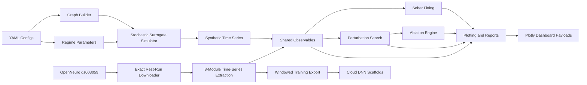

# Architecture

## Overview

The MVP is organized around a small number of explicit layers:

1. Config layer
2. Simulator layer
3. Metrics / feature extraction layer
4. Fitting and perturbation-search layer
5. Reporting and dashboard layer

## Package Boundaries

- `core.py`: typed configuration models and shared constants
- `graph.py`: module names, graph assembly, hierarchy helpers
- `simulator.py`: state integration and regime execution
- `metrics.py`: FC, dynamic FC, entropy, switching, metastability proxies
- `fit.py`: sober fitting objective and search routine
- `perturbation.py`: mechanism operators and ranking
- `ablation.py`: one-at-a-time and pairwise analyses
- `reporting.py`: figures, markdown snippets, JSON outputs
- `web/`: lightweight dashboard server and template assets
- `data/`: OpenNeuro ingestion, ds003059 extraction, target generation, and fallback interfaces
- `training.py`: windowed export helpers for later cloud experiments

## Rationale

The design favors explicit state variables, visible configuration, and inspectable intermediate outputs. Most of the scientific uncertainty sits in the perturbation interpretation, so the implementation intentionally keeps the mathematics simple and the claims narrow.
