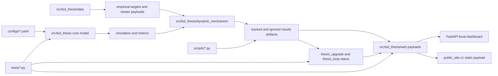
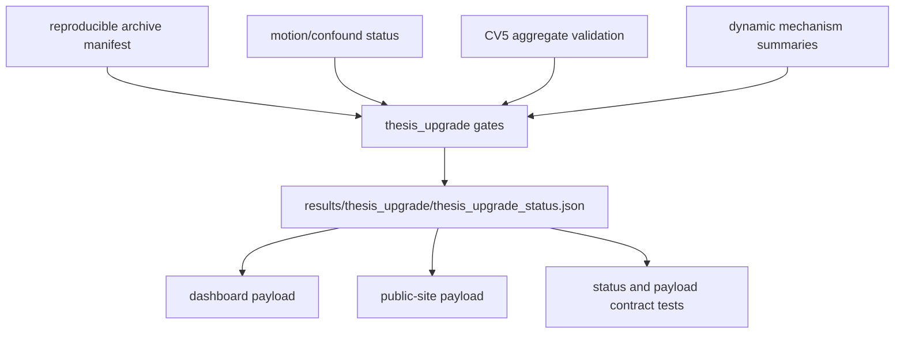
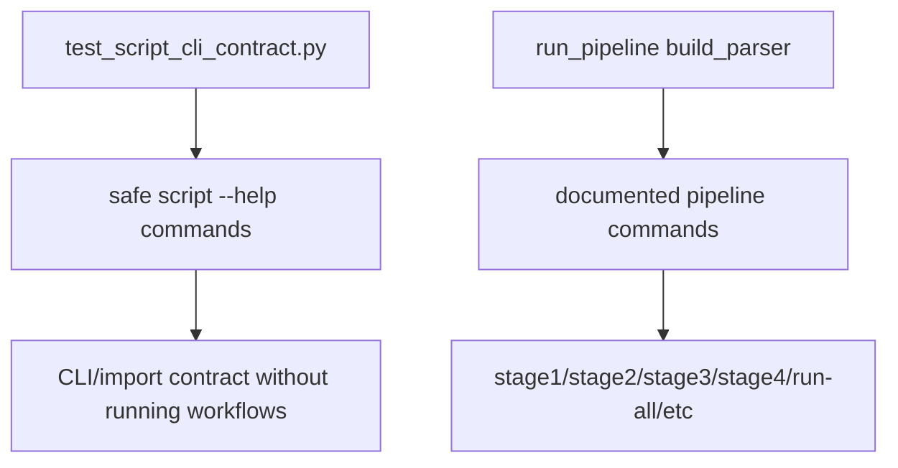
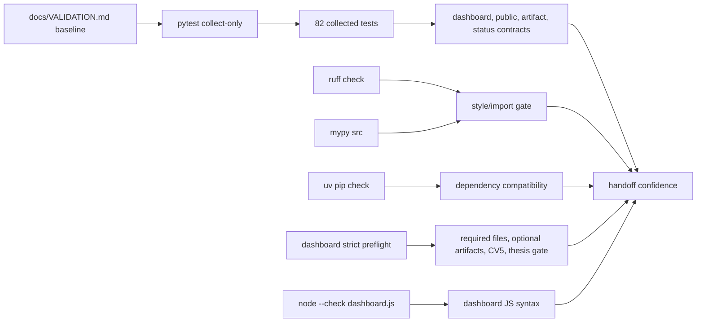
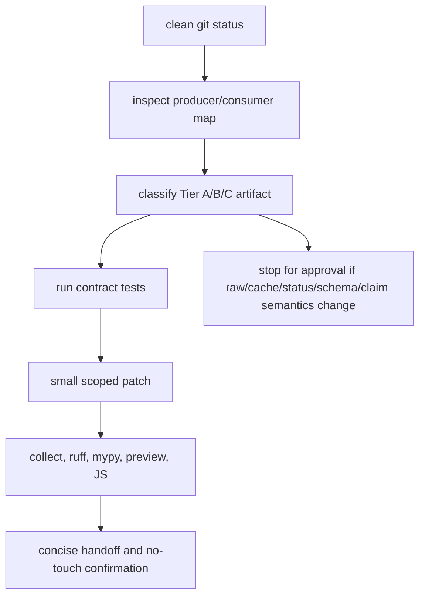

# LSD Thesis Project State Handoff

## 1. Title And Snapshot

Project: LSD Thesis - Macro-Dynamic Surrogate Model and Prior-Art Landscape

Repo path: `D:\LSD_Thesis`

Snapshot date: 2026-06-17

Current branch: `audit/full-cleanup-and-prior-art`

Current commit: `69b0397a64fb7ec6f5b19cc07f00565cec97c53b`

Current git status at the required initial gate: clean. The required first command was `git status --short --untracked-files=all`; the sandbox runner failed, then the same read-only command was rerun outside the sandbox and returned empty output.

Expected final git status after this report-only package: only untracked files under `docs/reports/project_state_handoff/`.

Latest validation baseline from `docs/VALIDATION.md`:

- Current status date: 2026-06-17.
- `ruff`: passed.
- `mypy src`: passed, 109 source files.
- `pytest --collect-only`: 82 tests collected.
- Full `pytest`: 82 passed, 82.69% coverage.
- `uv pip check`: passed.
- Dashboard strict preflight: passed.
- `node --check src\lsd_thesis\static\dashboard.js`: passed.

This handoff reran the safe non-generating checks listed in section 4. Full pytest was not rerun for this handoff. The latest known full pytest baseline is 82 passed with 82.69% coverage, from `docs/VALIDATION.md`.

## 2. Project Summary

This repository is a conservative computational neuroscience and Neuro-AI thesis workspace. It combines a transparent 8-module stochastic graph surrogate model with a structured ds003059 prior-art reproducibility landscape. The repo ranks macro-dynamic mechanism proxies against cached paired LSD/placebo fMRI summary evidence, publishes claim-gated dashboard payloads, and keeps unsupported biological, receptor-level, subjective, and clinical claims explicitly blocked or caveated.

## 3. Scientific And Research Purpose

The research aim is to test whether altered-state-like empirical macro-dynamics are better organized by transition, hierarchy/routing, dynamic repertoire, and control-energy proxy mechanisms than by generic noise, static connectivity, or weak baselines.

Established outputs:

- A transparent 8-module graph-modulated stochastic surrogate model.
- Cached ds003059 paired LSD/placebo aggregate and subject/run viewer artifacts.
- A dynamic mechanism ranking over A-E layers, currently led by C.
- Claim-gated thesis readiness, archive, dashboard, public-site, and evidence-loop status artifacts.
- A prior-art inventory covering 12 ds003059 analysis families.
- A static/public dashboard payload schema and a local FastAPI dashboard.

Current evidence:

- Dynamic mechanism summary is `implemented_first_pass` over 15 subjects and 30 paired records.
- Ranking order from current `results/dynamic_mechanism_ranking/summary.json`: C, E, D, A, B.
- Robustness status is `implemented_first_pass_robustness`.
- Internal subject-disjoint CV5 is complete as an internal validation status: 5/5 folds, approved, not external validation.
- Thesis readiness is 6/9 gates; strict completion is 4/6 gates; package readiness is 1/2 gates.

Hypothesis and interpretation:

- C is the strongest current macro-dynamic proxy layer.
- E is a split claim: useful for lower transition/control-energy proxy interpretation, not proof of receptor-specific placement.
- B remains a negative DMDc sanity baseline, not the main control-theory result.

Limitations:

- Motion/confound proof remains incomplete because the strict FD/DVARS/censoring predicate is not satisfied.
- Zenodo DOI verification is absent, so archive publication remains incomplete despite the verified GitHub release URL.
- External validation, receptor/PET, neuromaps, structural-connectome, parcellation, and run-02/music surfaces remain high-risk and claim-gated.
- No subjective-experience, receptor-level realism, clinical, or biological-ground-truth claims should be strengthened from these artifacts.

No-touch scientific semantics for future work:

- Preserve claim labels: `implemented`, `proxy-supported`, `mixed`, `unsupported`, `blocked`, `future`.
- Preserve status and gate semantics.
- Keep macro-dynamics/proxy wording separate from receptor, subjective, or biological ground-truth wording.
- Do not promote blocked motion, archive DOI, run-02/music, receptor-placement, or external-validation claims without explicit user confirmation and matching artifacts.

## 4. Current Validation State

Safe checks rerun during this handoff:

| Command | Current result |
|---|---|
| `uv run --frozen pytest --collect-only -q -o addopts=` | Passed; 82 tests collected in 23.97s |
| `uv run --frozen ruff check .` | Passed; all checks passed |
| `uv run --frozen mypy src` | Passed; no issues in 109 source files |
| `uv pip check` | Passed; 76 packages checked and compatible |
| `uv run --frozen python scripts\preview_dashboard.py --check-only --strict` | Passed; required files all present, optional artifacts all present, CV5 internal validation 5/5, thesis gate contract passed |
| `node --check src\lsd_thesis\static\dashboard.js` | Passed; exit code 0 |

Not rerun:

- Full `uv run --frozen pytest` was not rerun for this handoff because the user explicitly allowed skipping it unless clearly safe and reasonably fast. The latest known full-suite baseline remains the documented `docs/VALIDATION.md` result: 82 passed, 82.69% coverage.

## 5. Repository Architecture

Core package:

- `src/lsd_thesis/core.py`, `simulator.py`, `metrics.py`, `graph.py`, `perturbation.py`, `ablation.py`: model configuration, stochastic simulation, metrics, perturbation, and ablation surfaces.
- `src/lsd_thesis/dynamic_mechanism/`: A-E mechanism ranking internals.
- `src/lsd_thesis/data/`: ds003059, ds006072, parcellation, and empirical target helpers.
- `src/lsd_thesis/thesis_upgrade/`: thesis readiness gates, strict/package requirements, status formatting.
- `src/lsd_thesis/thesis_loop/`: evidence-loop status and claim matrix helpers.
- `src/lsd_thesis/web/`: dashboard, artifact, public-site, figure, empirical-viewer, and status payload assembly.
- `src/lsd_thesis/templates/` and `src/lsd_thesis/static/`: dashboard pages and static JS/CSS.

Scripts:

- Pipeline: `scripts/run_pipeline.py`.
- Dashboard: `scripts/run_dashboard.py`, `scripts/preview_dashboard.py`.
- Ranking and exports: `scripts/run_dynamic_mechanism_ranking.py`, `scripts/export_dynamic_mechanism_tables.py`, `scripts/export_training_dataset.py`.
- Thesis/status/archive: `scripts/run_thesis_evidence_loop.py`, `scripts/export_thesis_loop_tables.py`, `scripts/build_thesis_upgrade_status.py`, `scripts/build_reproducible_archive.py`, `scripts/build_github_pages.py`.
- Data/external/high-risk helpers: ds006072, OpenNeuro, neuromaps, receptor, structural-connectome, parcellation, motion/confound scripts.

Tests:

- 19 test files, 82 collected tests.
- Current tests emphasize dashboard payload contracts, public-site payload contracts, route aliases, artifact security, result artifact schemas, thesis status gates, script CLI help contracts, and validation metadata.

Docs and artifacts:

- `README.md`, `SPEC.md`, `ARCHITECTURE.md`, `AGENTS.md`, and `docs/VALIDATION.md` are the current source-of-truth docs for this handoff.
- `docs/reports/results_artifact_inventory.md` is the current artifact surface inventory.
- `docs/reference/` is historical/archive material and was not modified.



## 6. Main Execution Flows

Simulation/config/data to metrics/artifacts:

```mermaid
flowchart TD
    graph[configs/graphs/macro_modules.yaml] --> simulator[stochastic 8-module simulator]
    regimes[configs/regimes baseline/perturbed] --> simulator
    simulator --> metrics[proxy observables]
    ds003059[cached ds003059 summaries] --> empirical[empirical targets and viewer]
    empirical --> ranking[A-E mechanism ranking]
    metrics --> ranking
    ranking --> exports[JSON/CSV/XLSX/HTML artifacts]
    exports --> reports[stage reports and dashboard payloads]
```

Thesis upgrade/readiness status flow:



Dashboard/public-site payload flow:

```mermaid
flowchart LR
    dashboard_payload[build_dashboard_payload] --> api[/api/dashboard-data]
    dashboard_payload --> figures[figure payload and evidence flow]
    dashboard_payload --> public_builder[build_public_site_payload]
    public_builder --> public_api[/api/public-site-data]
    public_builder --> static_json[_site/dashboard/dashboard-data.json when built]
    artifacts[artifact allowlist] --> local_artifacts[/artifacts/...]
    tests[route, payload, href tests] --> dashboard_payload
    tests --> public_builder
```

Script CLI flow:



Testing/validation flow:



Artifact-serving/security flow:

```mermaid
flowchart TD
    request[/artifacts/{path}] --> normalize[normalize and resolve path]
    normalize --> allowlist{allowed root and extension?}
    allowlist -->|no| deny[403]
    allowlist -->|yes| exists{file exists?}
    exists -->|no| missing[404]
    exists -->|yes| headers[security headers and CSP]
    headers --> file[FileResponse]
```

Safe cleanup roadmap:



## 7. Dashboard And Public-Site Overview

Key local routes verified from `src/lsd_thesis/web/app.py` and tests:

- `/`, `/overview`
- `/ranking`
- `/robustness`
- `/prior-art`
- `/empirical`
- `/simulator`
- `/thesis`, `/thesis.html`
- `/figures`, `/figures.html`
- `/dashboard`, `/dashboard/`, `/local-dashboard`, `/local-dashboard/`, `/dashboard/full`, `/dashboard/full/`
- `/methods`, `/methods.html`, `/appendix`, `/appendix.html`
- `/api/dashboard-data`
- `/api/public-site-data`
- `/api/prior-art-data`
- `/api/empirical-view`
- `/api/simulate`
- `/artifacts/{artifact_path:path}`

Public JSON/payload surfaces:

- Dashboard payload from `build_dashboard_payload`.
- Public payload from `build_public_site_payload`, schema `public_site.v1`.
- Prior-art payload from `build_prior_art_payload`.
- Static Pages data exists under `_site/dashboard/dashboard-data.json` and `_site/dashboard/prior-art-data.json`, but no Pages/publication build was run.

Artifact href conventions:

- Local/public artifact links should start with `/artifacts/`.
- Backslashes are rejected in contract tests.
- Artifact serving is allowlisted by root and extension in `src/lsd_thesis/web/artifacts.py`.
- Subject-level empirical cache under `results/stage_2/empirical_viewer/subject_views/` is explicitly denied by artifact path policy.

Dashboard screenshots captured:

| File | Shows |
|---|---|
| `assets/screenshots/dashboard-overview.png` | Local dashboard overview page |
| `assets/screenshots/dashboard-ranking.png` | A-E mechanism ranking page |
| `assets/screenshots/dashboard-robustness.png` | Robustness and strict-gate page |
| `assets/screenshots/dashboard-prior-art.png` | Prior-art inventory page |
| `assets/screenshots/dashboard-empirical.png` | Empirical viewer page |
| `assets/screenshots/dashboard-figures.png` | Figure deck page |

Skipped visual steps:

- Full-page dashboard screenshots were attempted but skipped after Browser screenshot capture timed out on full-page capture; viewport screenshots were captured successfully.
- Existing `_site/dashboard/index.html` screenshot was skipped because the Browser tool blocked direct `file://` navigation by URL policy. No workaround or alternate browser surface was attempted.
- Mermaid rendering was skipped because `mmdc` was not installed and dependency installation was forbidden. Mermaid source diagrams are embedded in this report.

Dashboard contracts protected by tests:

- Route list and aliases: `tests/test_dashboard_route_contract.py`.
- Dashboard payload top-level schema, figure deck, and artifact hrefs: `tests/test_dashboard_payload_contract.py`.
- Public-site schema and artifact shapes: `tests/test_public_site_payload_contract.py`.
- Artifact security headers, denied paths, HTML/SVG CSP behavior, and API input validation: `tests/test_web_security.py`.
- Static payload refresh after thesis status changes: `tests/test_static_pages_payload_refresh.py`.

## 8. Results And Artifacts

The current artifact policy is summarized in `docs/reports/results_artifact_inventory.md`.

Tracked curated evidence:

- Status JSON and schema-bearing summaries under `results/`.
- Dynamic mechanism summary and robustness JSON.
- Thesis upgrade status JSON and MD.
- Reproducible archive manifest and checksums.
- Thesis evidence loop status and selected evidence bundles.
- CV5 curated aggregate status.
- Selected XLSX/GII/manifest artifacts that serve as curated evidence bundles.

Ignored/generated outputs:

- `results/**/*.csv`, `results/**/*.html`, `results/**/*.png`, NPY/NPZ caches, empirical viewer cache, temp test trees.
- `output/`, including report builds and publication figures.
- `_site/`, the static Pages snapshot.
- `autoresearch-results/`, which exists in this checkout and remains ignored/untracked.

Current read-only counts:

- `results/`: 9,219 files, about 442,630,770 bytes by recursive file inventory; 107 tracked `results` files; 9,235 ignored `results` paths by `git ls-files --others --ignored --exclude-standard results`.
- `output/`: 453 files, about 7,125,457 bytes.
- `_site/`: 198 files, about 17,551,456 bytes.

Risky artifact surfaces:

- Stage 2 empirical caches and viewer trees.
- Run-02/music and `results/setting_seed/run02_extraction/`.
- Motion/confound and fMRIPrep proof artifacts.
- Dynamic mechanism ranking and robustness outputs.
- Parcellation sensitivity, PET/receptor priors, neuromaps, HCP/structural-connectome outputs.
- Archive manifests/checksums and public-site payload JSON.
- `docs/reference/` historical material.

What not to edit/regenerate without approval:

- Raw data, caches, private data, ignored generated outputs, tracked result artifacts, `_site/`, `output/`, Stage 2, run-02/music, external downloads, Pages builds, dependency upgrades/removals, claim wording, claim labels, gate/status semantics, dashboard/public JSON schemas, routes, aliases, or artifact policy.

Representative figures copied:

| Copied file | Source path | Status | Why selected |
|---|---|---|---|
| `assets/representative_figures/stage1_metric_shift.png` | `output/doc/figures/stage1_metric_shift.png` | ignored generated output via `/output/` | Small existing publication figure showing Stage 1 metric shift |
| `assets/representative_figures/stage2_fit_robustness.png` | `output/doc/figures/stage2_fit_robustness.png` | ignored generated output via `/output/` | Small existing publication figure showing Stage 2 fit/robustness |
| `assets/representative_figures/pass2a_microsite.png` | `results/setting_seed/dashboard/screenshots/pass2a_microsite.png` | ignored generated PNG via `results/**/*.png` | Historical local setting/seed microsite screenshot, useful as visual context |
| `assets/representative_figures/set_setting_seed_live_8020.png` | `results/setting_seed/dashboard/screenshots/set_setting_seed_live_8020.png` | ignored generated PNG via `results/**/*.png` | Historical live local setting/seed screenshot, useful as visual context |

Original image files were not modified.

## 9. Tests And Safety Rails

Characterization tests added or now present:

- Dashboard payload contract tests protect top-level payload keys, graph node/edge shape, figure deck schema, and artifact href conventions.
- Dashboard route contract tests protect nav IDs, route aliases, and static/local route link shapes.
- Public-site payload tests protect `public_site.v1`, claim ladder requirements, viewer modes, prior-art cards, appendix artifacts, and href conventions.
- Result artifact schema tests protect Stage 2 summary/viewer schema, dynamic mechanism summary, robustness summary, and thesis evidence loop schema.
- Thesis upgrade status tests protect readiness summary fields, gate/requirement shapes, strict/package IDs, and component keys.
- Script CLI contract tests run only safe `--help` commands and parser checks, not scientific workflows.
- Figure payload tests require source artifacts, formula/calculation/caveat fields, claim statuses, and blocked archive/motion cards.
- Web security tests protect dashboard security headers, artifact allowlisting, denied subject-level cache paths, HTML figure sandboxing, and API validation.
- Validation status tests protect CV5 integrity semantics and prevent legacy held-out flags from overclaiming completion.
- Next-action evidence gate tests preserve motion/receptor/striatal status semantics and keep B as a negative baseline.

## 10. Recent Improvement History

Recent `git log --oneline -12`:

```text
69b0397 docs: refresh validation baseline
466382f experiment: guard selected script src bootstraps
af9d2ca test: characterize safe script cli contracts
744de04 refactor: move dashboard payload assembly out of app
1c562bc refactor: extract thesis upgrade gate helpers
d2e71e1 docs: inventory result and generated artifact surfaces
19e57aa refactor: simplify figure payload construction
1859b64 test: add dashboard and artifact contract coverage
e930888 docs: refresh stale repo commands and paths
a33feeb Polish mobile figure deck layout
729ff68 Refresh public evidence build artifacts
cf45ac3 Restore ds003059 package regression tests
```

Verified cleanup sequence:

- Pass 1, docs truth pass: `e930888` refreshed stale repo commands and paths.
- Pass 2, characterization tests: `1859b64` added dashboard, public-site, route, artifact schema, and thesis status contract coverage.
- Pass 3, figure payload refactor: `19e57aa` simplified figure payload construction.
- Pass 4, artifact/results inventory report: `d2e71e1` created `docs/reports/results_artifact_inventory.md`.
- Pass 5, thesis upgrade gate/status helper extraction: `1c562bc` refactored `thesis_upgrade` gates and requirements helpers.
- Pass 6, dashboard payload decomposition: `744de04` moved dashboard payload assembly out of `app.py`.
- Pass 7B, script CLI/import characterization tests: `af9d2ca` added safe script CLI contract tests.
- Pass 7C, selected script `SRC_ROOT` bootstrap cleanup: `466382f` guarded selected script bootstraps.
- Validation baseline sync: `69b0397` refreshed `docs/VALIDATION.md`.

Why the repo is safer now:

- Dashboard and public contracts are encoded in tests instead of implicit in templates.
- Status vocabulary and gate fields have schema tests.
- CLI help coverage checks import/bootstrap safety without running heavy workflows.
- Artifact surfaces are inventoried before cleanup.
- Figure payload code is smaller and more explicit about source/caveat/claim status.
- The validation baseline separates current status from historical notes.

## 11. Current Quality Assessment

Strengths:

- Clear project framing and claim guardrails in `AGENTS.md`, `README.md`, and current payloads.
- Good contract coverage for dashboard, public-site, artifact hrefs, route aliases, status payloads, and major result schemas.
- Strong no-touch artifact policy and a useful artifact inventory.
- Current validation checks are green.
- The dashboard can be launched locally without running scientific workflows.

Maintainability wins:

- Dashboard payload assembly is decomposed out of the FastAPI app.
- Thesis gate/requirement helpers are separated from formatting.
- Figure payload explainers keep source, formula, caveat, and claim status together.
- Script CLI contracts make Windows import/bootstrap drift easier to catch.

Remaining bottlenecks:

- Full scientific workflow execution is still data/cache/environment sensitive.
- Stage 2 and empirical viewer caches are large and risky to move.
- `output/` and `_site/` remain generated but locally important.
- Full pytest was not rerun in this handoff, so coverage is taken from the documented baseline.

Known risks:

- Motion/confound proof remains the central scientific blocker.
- Zenodo DOI verification remains absent.
- External validation and receptor/PET/neuromaps/SC interpretations can be accidentally overpromoted.
- Static public payloads can drift if Pages builds are run casually.
- Ignored outputs may still be consumed by local dashboard/public artifact links.

Fragile areas:

- Artifact cleanup or reclassification.
- Claim/status vocabulary changes.
- Dashboard/public JSON schema changes.
- Routes and artifact alias compatibility.
- Run-02/music and raw/cache paths.

## 12. No-Touch / High-Risk Areas

Do not touch without explicit approval:

- Stage 2 pipeline, caches, empirical viewer, and parcellation outputs.
- Dynamic mechanism split, ranking, robustness, and exports.
- Parcellation/data-fetch/OpenNeuro paths.
- Pages builder rewrite or static `_site/` rebuild.
- Dependency upgrades, removals, or lockfile changes.
- Result artifact pruning, movement, compression, or tracking-policy changes.
- `docs/reference/` pruning or rewriting.
- Raw/cache/private data, `.env`, credentials, NPY/NPZ caches, and `data/`.
- Run-02/music extraction and setting-seed run-02 paths.
- Neuromaps, PET, receptor, HCP, structural-connectome paths.
- Scientific claim wording, claim labels, gate semantics, status vocabulary, route aliases, public JSON schemas, and artifact policy.

## 13. Recommended Next Finishing-Touch Tracks

| Rank | Track | Goal | Risk | Agent | Metric | Validation | Likely files | Avoid |
|---:|---|---|---|---|---|---|---|---|
| 1 | Artifact-tier README | Add a concise current artifact-tier guide that points to the inventory | Low | Ordinary Codex | Fewer ambiguous cleanup decisions | `uv run --frozen pytest --collect-only -q -o addopts=`; `uv run --frozen ruff check .` | `docs/` only | No artifact movement or deletion |
| 2 | Dashboard visual review | Review screenshot/UI polish without schema or route changes | Low/medium | Ordinary Codex | Screenshots and contract tests remain stable | dashboard route/payload tests; `node --check` | templates/static only if approved | No public schema, route, or claim label changes |
| 3 | Motion-proof planning pack | Document exact evidence needed for FD/DVARS/censoring proof | High | Ordinary Codex for planning; codex-autoresearch only for bounded source discovery if approved | Strict predicate checklist completeness | preview strict; thesis status tests | docs or planning report | No raw data download, no status promotion |
| 4 | Public-site snapshot audit | Compare local dashboard payload to `_site/` snapshot without rebuilding | Medium | Ordinary Codex | Drift report only | public payload tests; `node --check` | new report under `docs/reports/` | No Pages build unless approved |
| 5 | Entry points/pre-commit proposal | Decide whether package entry points or pre-commit add value | Medium | Ordinary Codex | Proposal with exact commands and rollback | collect-only, ruff, mypy | `pyproject.toml` only if later approved | No dependency install/lock churn in planning pass |
| 6 | Result consumer map | Extend artifact inventory with producer/consumer matrix for high-risk outputs | Medium | Ordinary Codex | Each target artifact has producer, consumer, test coverage | schema tests and targeted grep | `docs/reports/` | No cleanup or regeneration |
| 7 | External/PET/SC evidence audit | Recheck external, PET, neuromaps, SC status without changing claims | High | codex-autoresearch may be appropriate only if explicitly approved and metric-bounded | Confirmed evidence gaps and blocked/mixed labels | next-action gate tests | new report or status-only docs | No claim promotion, no downloads without approval |
| 8 | Mobile/static dashboard accessibility review | Inspect mobile screenshots and accessibility labels | Low/medium | Ordinary Codex | Screenshots plus no route/schema changes | dashboard redesign tests; `node --check` | templates/static only if approved | No visual rewrite or one-note redesign |

## 14. Manual Maintenance Guide

Before editing:

- Run `git status --short --untracked-files=all`.
- Read `AGENTS.md`, `docs/VALIDATION.md`, and the file-specific tests.
- For source changes, run the smallest relevant test first.
- For dashboard/public work, run route/payload/schema tests before and after.

Safe review order:

1. Read current docs and tests.
2. Map producers and consumers.
3. Identify tracked versus ignored/generated status.
4. Confirm claim label and status vocabulary boundaries.
5. Patch the smallest surface.
6. Run collect-only, ruff, mypy, preview strict, JS check, and focused tests.

Before deleting or moving artifacts:

- Check `git ls-files <path>`.
- Check `git check-ignore -v <path>`.
- Search producers and consumers with `rg`.
- Confirm whether dashboard/public site, archive manifest, or tests reference the path.
- Stop if the artifact is Stage 2, run-02/music, raw/cache/private, `_site/`, `output/`, PET/SC/neuromaps, archive, or thesis status evidence.

Reviewing dashboard changes:

- Preserve routes and aliases.
- Preserve `/artifacts/` href conventions.
- Preserve `public_site.v1` unless a migration is explicitly approved.
- Keep local `/api/simulate` and `/api/empirical-view` boundaries separate from static public output.
- Run `node --check src\lsd_thesis\static\dashboard.js`.

Reviewing claim wording:

- Compare against `AGENTS.md` and current status artifacts.
- Keep blocked gates blocked unless the strict predicate changes.
- Do not replace proxy, mixed, blocked, or future labels with success language.
- Treat prior-art wrappers as context/reproducibility inventory, not original analysis.

Checkpointing:

- Create or confirm a git checkpoint before meaningful edits.
- Do not stage ignored/generated/raw outputs casually.
- Use `git status --short --untracked-files=all` before and after.

## 15. Questions For The Human

- Should the next visual pass prioritize local dashboard readability, public-site static sharing, or thesis defense figure export?
- What is the hard boundary for promoting C from proxy-supported to thesis-level claim: motion proof only, or also parcellation and external stress tests?
- Should ignored `output/` figures remain copied into handoff/report packages, or should future reports reference originals only?
- Is the public user expected to use only static Pages, or should local FastAPI routes remain the primary review surface?
- Are dependency/tooling changes acceptable later for pre-commit or package entry points, or should this repo stay manual-command-first?
- Should `autoresearch-results/` remain ignored control-plane state, or should future handoffs mention it only when it appears in git status?

## 16. Appendix

Commands run:

- `git status --short --untracked-files=all`
- `git log --oneline -12`
- `git log --oneline --stat -8`
- `git branch --show-current`
- `git rev-parse HEAD`
- Read-only file inspections for `docs/VALIDATION.md`, `README.md`, `ARCHITECTURE.md`, `SPEC.md`, `AGENTS.md`, `docs/reports/results_artifact_inventory.md`, `pyproject.toml`, selected `src/lsd_thesis/web/*`, selected tests, and selected JSON status artifacts.
- `rg --files src\lsd_thesis`
- `rg --files scripts`
- `rg --files tests`
- Read-only inventories for `results/`, `output/`, `_site/`, selected images, and `autoresearch-results/`.
- `uv run --frozen pytest --collect-only -q -o addopts=`
- `uv run --frozen ruff check .`
- `uv run --frozen mypy src`
- `uv pip check`
- `uv run --frozen python scripts\preview_dashboard.py --check-only --strict`
- `node --check src\lsd_thesis\static\dashboard.js`
- Localhost-only dashboard start via `uv run --frozen uvicorn lsd_thesis.web.app:app --host 127.0.0.1 --port 8000`
- Browser viewport screenshot captures for local dashboard pages.
- `Stop-Process -Id 9852`
- `Get-Command mmdc -ErrorAction SilentlyContinue`

Files inspected:

- `README.md`
- `ARCHITECTURE.md`
- `SPEC.md`
- `AGENTS.md`
- `docs/VALIDATION.md`
- `docs/reports/results_artifact_inventory.md`
- `pyproject.toml`
- `src/lsd_thesis/`
- `src/lsd_thesis/web/`
- `scripts/`
- `tests/`
- `results/` inventory and selected JSON status artifacts
- `_site/` inventory only
- `output/` inventory and selected image artifacts
- `docs/reference/` was not modified and was not needed beyond recognizing it as historical/archive material from repo instructions and inventory docs.

Visual assets list:

- Screenshots: six local dashboard viewport screenshots under `assets/screenshots/`.
- Representative figures: four copied existing image artifacts under `assets/representative_figures/`.
- Diagrams: Mermaid source diagrams embedded in this Markdown report; no rendered diagram files.

Skipped visual/image steps:

- Full-page screenshots: skipped after Browser CDP full-page capture timed out.
- Static `_site` screenshot: skipped because Browser blocked `file://` navigation by URL policy.
- Mermaid rendering: skipped because no `mmdc` command was installed and dependency installation is forbidden.

Manifest summary:

- Machine-readable manifest: `docs/reports/project_state_handoff/manifest.json`.
- Pasteback brief: `docs/reports/project_state_handoff/CHATGPT_PASTEBACK.md`.
- This full report: `docs/reports/project_state_handoff/PROJECT_STATE_HANDOFF.md`.
